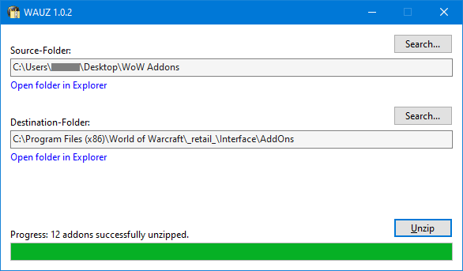

# WAUZ
A tiny unzip tool for World of Warcraft addons

### What it is

- It´s a very simple and tiny .NET 6 application named WAUZ (**W**orld of Warcraft **A**ddons **U**n**Z**ip).
- It´s used to unzip a bunch of downloaded zip files, located in one folder, into another folder. In this case the zip files are addons for the popular [World of Warcraft](https://worldofwarcraft.com) MMORPG game.
- It´s just a typical ".exe file" Windows application. Just download the newest release, unzip and run it. That´s it. No installer, setup or something like that. It´s sole purpose is to extract zip files into a folder. Nothing else. It´s just there to make your life a little bit easier. 

### How it works

- Download a bunch of World of Warcraft addons (typically from https://www.curseforge.com) into some folder.
- Start WAUZ
- Select the folder which contains the addon zip files ("Source-Folder"). Typically some temporary download folder.
- Select the folder to unzip the addons into ("Destination-Folder). Typically the World of Warcraft AddOns folder.
- Press the "Unzip" button.

:warning:

Please also read this [important notes](#important-notes-when-using-release-version-103-or-higher) below, to make sure you not accidentally loose data! Because all releases after 1.0.2 will clear all existing content inside the selected destination folder, by design.

### Why it exists
I developed a download manager for World of Warcraft addons, called [WADM](https://github.com/mbodm/wadm), over a decade ago. For many many years WADM handled all of my addon updating needs with ease. But since Curse/Overwolf changed their political stance, alternative download managers (like mine, Ajour, WowUp, or others) no longer works with the https://www.curseforge.com site, or their REST web service. The only option is to use their own addon download manager. Many of us don´t want that, for different reasons.

So, downloading the addons manually (which is not the time consuming bottleneck here) and unzipping them, with the help of a tool like WAUZ, is still not the worst alternative to a full featured download manager. For more information about "the end of all alternative addon download managers" follow the links on the GitHub site of my above mentioned WADM project, or use your GoogleFu.

### An easy way to grab your addons

Some additional hint here (since this has nothing to do with the tool per se):

A fast and easy way to get all the actual addon zip files is to bookmark all the direct download sites, for every addon, in your browser. Especially for https://www.curseforge.com you can bookmark an addon´s download site directly. The addon download immediately starts, after clicking the bookmark. This helps a lot to get all the latest addon versions very fast, without much effort. This way you quickly have all of them in a single folder. The process of manually unzipping them is way more time consuming. But that´s the moment when WAUZ comes to rescue. :wink:

### Requirements

- 64-bit Windows

There are not any other special requirements. All the release-binaries are compiled with _win-x64_ as target platform, assuming you are using some 64-bit Windows (and that's quite likely).

You can choose between _self-contained_ and _framework-dependent_ .NET application builds, when downloading a release. If you want to run the _framework-dependent_ version, you need (as additional requirement) an installed .NET 6 runtime. You can find more information about that topic on the [Releases](https://github.com/mbodm/wauz/releases) page.

### Notes
- WAUZ saves your selected folders automatically in a settings file when you close the app.
- WAUZ loads your selected folders automatically from that settings file when you open the app.
- WAUZ writes a log file if some error happens.
- You can find both files (settings and log) in the "C:\Users\YOUR_USER_NAME\AppData\Local\MBODM" folder.
- WAUZ uses a timeout of 30 seconds, while unzipping the files.
- WAUZ unzips the files in parallel.
- ~~WAUZ will not touch any other files or folders in Destination-Folder, besides the ones coming from the zip files.~~
- :warning: Be careful: Since release version 1.0.3 the previous statement is no longer true! :warning:
- WAUZ is written in C# and developed with .NET 6, in Visual Studio 2022.
- WAUZ is using Windows.Forms as UI framework (yes, because "rapid development").
- There will be also a command line version of WAUZ. Soon.
- I never compiled WAUZ with other tools, like Rider or VS Code. I solely used Visual Studio 2022 Community.
- If you want to compile by yourself, you can just use i.e. Visual Studio 2022 (any edition). You need nothing else.
- The release-binaries are compiled with "win-x64" as target platform (_self-contained_ and _framework-dependent_).
- The release-binaries are compiled with "ReadyToRun compilation", checked in the Visual Studio Publish dialog.
- The code is using the TAP pattern of .NET, including concurrency concepts like `async/await` and `IProgress<>`.
- The code is using a typical `CancellationToken` timeout approach.
- WAUZ is under MIT license. Feel free to use the source and do whatever you want. I assume no liability.
- WAUZ just exists, because i am lazy and made my life a bit easier, by writing this tool (for me and some friends). :grin:

### Important notes when using release version 1.0.3 or higher

The way WAUZ works and doing its unzip job (under the hood) has completely changed in the 1.0.3 release version! Therefore i need to explain this a bit more in detail here.

At the moment there is still some ongoing development and descission finding in progress. Therefore i quickly out-commented all the text, that already existed here. More to come. Stay tuned!

<!--
since this may be important for the user, when it comes down to "data loss" inside the selected destination folder.

The short version:

With the release of version 1.0.3 WAUZ now always clears the selected destination folder (removing all files and folders inside it), before the unzip process even starts. This means: If in example a zip file is corrupted and WAUZ stops, you already lost all of your old/existing addons inside the destination folder. In 99% of all cases this should be no problem, because the destination folder is normally just a "working folder" for binary stuff, solely used for the addon "applications". This applies also and foremost to the "World of Warcraft AddOns" folder (when used as destination folder in WAUZ). Normally no sensible data (personal data, config files, or something like that) should reside there. Even the addons themselfes store their config files in another location (another specific folder inside the World of Warcraft installation folder). But: If you stored anything important in the selected destination folder, for whatever reason, make sure you create a backup before pressing the "Unzip" button! If you want to know more about "how it worked before and why this has changed", just continue reading.

The long (technical background) version:

How it worked before version 1.0.3 was released?

In the past WAUZ first unzipped an addon zip file into a temp folder (a folder with some random generated name, under the user´s temp folder, in "C:\Users\XXX\AppData\Local\Temp"), specific to that addon unzip file. Then WAUZ inspected the name of every file and folder (let´s call it "source" here) inside that temp folder and checked if the destination folder also contains a file or folder with that name (let´s call it "target" here). If existing, WAUZ deleted specifically that "target" inside the destination folder (this is the important part here). And then WAUZ moved the "source" to the destination folder. WAUZ repeated exactly this approach for every single addon zip file. The result of this was: _"WAUZ will not touch any other files or folders in Destination-Folder, besides the ones coming from the zip file."_, as mentioned in the [notes](#Notes) above

Why this has changed?

While the above approach has the big benefit of _"not touching any other files or folders in the selected destination folder, besides the ones coming from the zip file"_, when you look at it from a data security point of view, this also has a downside: Some addons (and their content, the files/folders) change over time. And since the only files/folders that are deleted in the destination folder, are the files/folders (filenames/foldernames) that are also included in an actual addon zip file, the leftover data junk and clutter (of older addon files/folders) gets more and bigger over time. This means: Exactly the same thing that helps with "not deleting any additional data" is also the reason for "leftover data junk and clutter". Since there is no way to get "the best of both worlds" i had to decide for one or the other. And since the typical addons destination folder is just some "binaries" folder and typically not contains any data to backup, i decided to stick with the "clear destination folder completely, before unzipping the addons into it" approach.

More technical background and thoughts

There are a few ways, the unzip process can be handled, in general. Let´s quickly have a look at them:

- Approach 1:
Remove all content inside the destination folder (the old/existing addon files and folders) first, before even start the unzip process. Then unzip all addons directly into the destination folder. This is the approach release version 1.0.3 uses now.
- Approach 2:
Unzip all addons in separate temp folders. When no error occurred, while unzipping, just replace every file/folder in the destination folder with the ones from the temp folder. This is the approach release version 1.0.0-1.0.2 used.
- Approach 3:
Unzip all addons first, into a single temp folder. Then remove all files/folders in the destination folder and move all files/folders from temp folder to destination folder.
-->

#### Have fun.

---

> ##### Personal ideas
> - This is a list of ideas, used as my personal todo list. Better centralized here, than somewhere else.
> - Add WAUZ command line version (easy, BusinessLogic already exists).
> - :heavy_check_mark: Maybe add navigation links to UI, to quickly open the selected folders in Explorer?
> - :x: !!! Decided against !!! --> Maybe add navigation links to UI, to quickly open the settings/log files or folder?
> - :x: Decided against previous point since the log file not exists 99% of the time, since its just created on hard errors.
> - :x: Decided against previous point since the settings shall not be prominent (in contrast to the WADM config file).
> - :heavy_check_mark: !!! Added in 1.0.3, removed in 1.0.4 !!! Maybe implement some temp folder cleanup check, before unzipping?
> - :heavy_check_mark: !!! Added in 1.0.3, removed in 1.0.4 !!! To cleanup any old temp folders if app was closed too early in previous session.
> - Add more log infos (logfile size?) to better reproduce what happened? Not meant as "log everything".
> - But maybe add additional infos when logging an exception (like the selected folders, etc).
> - :heavy_check_mark: !!! Useless since 1.0.3 !!! --> Maybe implement checkbox option to remove all content of Destination-Folder before unzip?
> - :heavy_check_mark: !!! Useless since 1.0.3 !!! --> Do users really want/need that? (Maybe the above "Open in Explorer" option is enough here)
> - :heavy_check_mark: Missing or wrong selected folders lead to "Error occurred" UI status. Keep this behaviour? Descission: No.
> - Maybe add a ListView with CheckBoxes to select zip files, before unzipping?
> - :heavy_check_mark: Change TextBox placeholder text.
