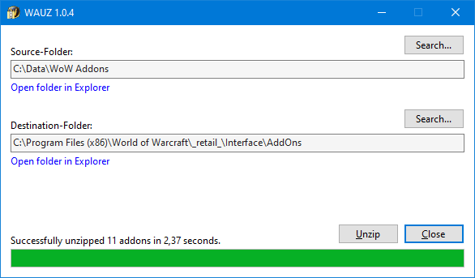

# WAUZ
A tiny unzip tool for World of Warcraft addons



### What it is
It´s a very simple and tiny .NET 6 application named WAUZ (**W**orld of Warcraft **A**ddon **U**n**Z**ip). It´s used to unzip a bunch of downloaded zip files inside some folder, into another folder (in this case the zip files are addons for the popular [World of Warcraft](https://worldofwarcraft.com) MMORPG game). It´s sole purpose is just to unzip the files into a folder, to make your life a little bit easier. Nothing else.

### How it works
- Download a bunch of World of Warcraft addons (typically from https://www.curseforge.com) into some temporary download folder.
- Start WAUZ
- Select the folder which contains the downloaded addon zip files (Source-Folder). Typically some temporary download folder.
- Select the folder to unzip the addons into (Destination-Folder). Typically the World of Warcraft AddOns folder.
- Press the "Unzip" button.
- Hint: Bookmark all the direct download sites, for every addon, in your browser. Especially for https://www.curseforge.com you can bookmark an addon´s download site directly. The addon download immediately starts, after clicking the bookmark. This helps a lot to get all the latest addon versions very fast, without much effort, and you quickly have all of them in a single folder. The process of manually unzipping them all, is way more time consuming. But that´s the moment when WAUZ comes to rescue. :)
- Hint: WAUZ will never remove, overwrite or touch any other files or folders in the Destination-Folder, besides the files and folders that will be unzipped from the zip files.
- Hint: WAUZ will save your folder settings automatically, when you close the app.

### Why it exists
I wrote a full featured download manager, called [WADM](https://github.com/mbodm/wadm), over a decade ago. For many many years WADM handled all of my addon updating with ease. But since Curse/Overwolf changed their political stance, download managers like WADM or others no longer works with https://www.curseforge.com and their REST api. So downloading them manually (which is not the time consuming bottleneck here) and unzipping them, with the help of a tool like WAUZ, is a good alternative to a full fledged download manager. For more information about the "end of all alternative addon download managers" follow the links on my above mentioned WADM GitHub site, or use your GoogleFu.

### Requirements
There are not any special requirements, besides having WinGet installed on your machine. `wingetupd.exe` is just a typical command line ".exe" file for Windows. Just download the newest release, from the [Releases](https://github.com/MBODM/wingetupd/releases) page, unzip and run it. All the releases are compiled for x64, assuming you are using some 64-bit Windows (and that's quite likely).

### Notes
- When `wingetupd.exe` starts, it creates a log file named "wingetupd.log" in the same folder.
- So keep in mind: That folder needs security permissions for writing files in it.
- Some locations like "C:\\" or "C:\ProgramFiles" don´t have such security permissions (for a good reason).
- If you don´t wanna run `wingetupd.exe` just from Desktop, "C:\Users\USERNAME\AppData\Local" is fine too.
- You can also use the `--no-log` parameter, to prevent the creation of the log file (`wingetupd.exe --no-log`).
- All internally used WinGet calls are based on exact WinGet package-id´s (WinGet parameters: `--exact --id`).
- Use `winget search`, to find out the package-id´s (you put into the package-file) of your installed applications.
- Use the `--no-confirm` parameter, to automatically update packages, if `wingetupd.exe` is used inside a script.
- `wingetupd.exe` uses a timeout of 30 seconds, when waiting for WinGet to finish.
- Since some installations can take rather long, this timeout is increased to 60 minutes, while updates occur.
- The release binaries also contain a `wingetupd.bat` file, so you can run `wingetupd.exe` by a simple doubleclick.
- Q: _Why this tool and not just `winget --upgrade-all` ?_ A: Often you don´t wanna update all stuff (i.e. runtimes).
- Q: _Why this tool and not just some .bat or .ps script ?_ A: Maybe this is some better "out of the box" approach.
- At time of writing, the package-id _Zoom.Zoom_ seems to missmatch the corresponding installed _Zoom_ package.
- I assume the WinGet-Team will correct this wrong behaviour in their [packages repository](https://github.com/microsoft/winget-pkgs/tree/master/manifests) soon.
- WinGet doesn´t support being called in parallel. If you fork: Don´t use concurrency, like `Task.WhenAll()`.
- `wingetupd.exe` is written in C#, is using .NET 6 and is built with Visual Studio 2022.
- If you wanna compile the source by your own, you just need Visual Studio 2022 (any edition). Nothing else.
- The release-binaries are compiled as _self-contained_ .NET 6 .exe files, with "win-x64" as target.
- _Self-contained_: That´s the reason why the binariy-size is 15 MB and why there is no framework requirement.
- The _.csproj_ source file contains some MSBUILD task, to create a zip file, when publishing with Visual Studio 2022.
- GitHub´s default _.gitignore_ excludes VS publish-profiles, so i added a [publish-settings screenshot](img/screenshot-publish-settings.png) to repo.
- The code is using the TAP pattern of .NET, including concurrency concepts like `async/await` and `IProgress<>`.
- `wingetupd.exe` just exists, because i am lazy and made my life a bit easier, by writing this tool. :grin:

#### Have fun.


### How it works
- WinGetDotNet is released as .NET assembly (.dll). Just download and add it to your existing project.
- WinGetDotNet is released as .NET NuGet package (.nupkg). Just add it to your NuGet package source and use it.
- WinGetDotNet offers a method that asynchronously starts a _WinGet_ process as `Task`, to `await` the process.
- WinGetDotNet returns the _WinGet_ console output and exit code, after the awaitable process has finished.
- WinGetDotNet is using the `System.Diagnostics.Process` class to run _WinGet_.
- WinGetDotNet is using the TAP pattern, including typical `async/await` and `CancellationToken` concepts.
- WinGetDotNet is using a typical `CancellationToken` timeout pattern.
- WinGetDotNet is developed by using the [SOLID principles](https://en.wikipedia.org/wiki/SOLID) in a typical manner.

### Quick overview

Here are some excerpts, to give a quick overview on how it looks like, for a first impression:

- Property to verify if _WinGet_ is installed:
    ```csharp
    bool WinGetIsInstalled { get; }
    ```
- Method to run _WinGet_ asynchronous:
    ```csharp
    Task<WinGetResult> RunWinGetAsync(string parameters, CancellationToken cancellationToken = default)
    ```
- Method to run _WinGet_ asynchronous, with a given timeout:
    ```csharp
    Task<WinGetResult> RunWinGetAsync(string parameters, TimeSpan timeout, CancellationToken cancellationToken = default)
    ```
- Result model, containing data about how _WinGet_ was called, as well as it´s output and it´s exit code:
    ```csharp
    record WinGetResult(string ProcessCall, string ConsoleOutput, int ExitCode);
    ```
For more information, just use the IntelliSense tooltips of Visual Studio, or take a look into the source code. It´s really a rather small and simple library and not much more than what you see above. 😉

### Requirements
There aren´t any special requirements, besides having _WinGet_ installed on your machine. WinGetDotNet is just a typical .NET assembly, released as assembly DLL and NuGet package. Just download the newest release, from the [Releases](https://github.com/MBODM/WinGetDotNet/releases) page, unzip and add it to your project. All the releases are compiled for x64 Windows, assuming you are using some 64-bit Windows (and that's quite likely).

### Notes
- WinGetDotNet is under MIT license. Feel free to use the source and do whatever you want. I assume no liability.
- WinGetDotNet is written in C#, is using .NET 6 and is built with Visual Studio 2022.
- To compile the source by your own, you just need some Visual Studio 2022 edition. Nothing else.
- I never compiled it with other tools, like Rider or VS Code. I solely used Visual Studio 2022 Community.
- The release-binaries are compiled as _self-contained_ .NET 6 assemblies, with "_x64 Windows_" as target.
- _Self-contained_: That´s the reason why the binary-size may be bigger and why there is no framework dependency.
- GitHub´s default _.gitignore_ excludes Visual Studio 2022 publish-profiles, so i added a [screenshot](img/screenshot-publish-settings.png) to repo.
- WinGetDotNet offers a `Task` based approach, but the _WinGet_ app itself can´t run concurrently, without errors.
- So keep above fact in mind, before writing real concurrent code, by using i.e. `Task.WhenAll()` etc.
- WinGetDotNet just exists, because it started as a sidecar project of my  [wingetupd](https://github.com/MBODM/wingetupd) tool. :grin:

#### Have fun.

